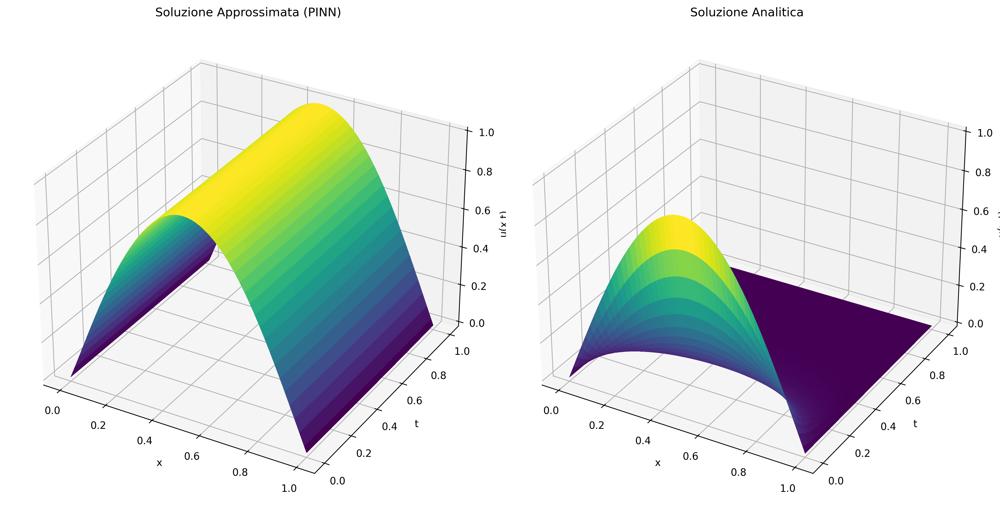

# Relazione Progetto: Reti Neurali Fisicamente Informate per l'Equazione del Calore

## 1. Introduzione

Questo progetto esplora l’applicazione delle **Reti Neurali Fisicamente Informate (Physics-Informed Neural Networks, PINN)** alla risoluzione dell’equazione del calore, un’equazione differenziale parziale (PDE) fondamentale nella fisica matematica.

Le PINN rappresentano un approccio innovativo che combina l’apprendimento automatico con la conoscenza delle leggi fisiche, permettendo di risolvere problemi differenziali complessi **senza ricorrere a tecniche numeriche tradizionali** come le differenze finite o gli elementi finiti.

### 1.1 L'Equazione del Calore

L’equazione del calore è una tra le equazioni differenziali più importanti nella fisica matematica e descrive la distribuzione della temperatura in una regione nel tempo. In questo progetto, consideriamo il problema monodimensionale:

$$
\frac{\partial u}{\partial t} = \frac{\partial^2 u}{\partial x^2}, \quad x \in [0,1], \quad t \in [0,1]
$$

Con le seguenti condizioni:
- **Condizione iniziale**: $ u(x, 0) = \sin(\pi x) $
- **Condizioni al contorno**: $ u(0,t) = u(1,t) = 0 $

Per questo problema specifico, esiste una soluzione analitica:

$$
u(x,t) = \sin(\pi x) e^{-\pi^2 t}
$$

Questa soluzione rappresenta un’onda sinusoidale che decade esponenzialmente nel tempo.

### 1.2 Obiettivo del Progetto

Gli obiettivi principali sono stati:

1. Implementare una rete neurale fisicamente informata per approssimare la soluzione $ u(x,t) $.
2. Confrontare la soluzione approssimata con la soluzione analitica nota.
3. Analizzare l’impatto dell’architettura della rete, della funzione di perdita e delle strategie di ottimizzazione sulla qualità della soluzione.

---

## 2. Metodologia

### 2.1 Approccio con PINN

Una **PINN (Physics-Informed Neural Network)** è una rete neurale addestrata non solo sui dati osservati ma anche sulle leggi fisiche del sistema. Questo tipo di approccio permette di integrare PDE direttamente nella funzione di perdita.

L'approccio si distingue dai metodi numerici tradizionali perché:
- Non richiede discretizzazione rigida del dominio
- Gestisce facilmente domini irregolari e condizioni complesse
- Fornisce una soluzione continua e derivabile
- Sfrutta la potenza dell’apprendimento automatico e della differenziazione automatica

### 2.2 Architettura della Rete Neurale

La rete utilizzata ha la seguente struttura:
- Input: $(x, t)$ → 2 valori
- Strati nascosti: 3 strati con 64 neuroni ciascuno e attivazione `Tanh`
- Output: valore scalare $u(x, t)$

La scelta della funzione di attivazione `Tanh` è motivata dalla sua idoneità per modelli basati su PDE grazie alla sua continuità e derivabilità.

### 2.3 Funzione di Perdita

La funzione di perdita totale include tre componenti principali:

- **$ L_{\text{PDE}} $**: Errore sull’equazione differenziale
- **$ L_{\text{IC}} $**: Errore rispetto alla condizione iniziale
- **$ L_{\text{BC}} $**: Errore rispetto alle condizioni al contorno

La funzione di perdita totale è definita come:

$$
L = \lambda_{\text{PDE}} \cdot L_{\text{PDE}} + L_{\text{IC}} + L_{\text{BC}}
$$

Dove $ \lambda_{\text{PDE}} = 100 $, per dare maggiore enfasi all’equazione fisica.

### 2.4 Differenziazione Automatica

Un aspetto chiave dell’approccio PINN è l’utilizzo della **differenziazione automatica**, fornita da PyTorch (`torch.autograd`), per calcolare le derivate spaziali e temporali necessarie per valutare il residuo PDE.

### 2.5 Strategia di Campionamento

I punti collocation vengono generati casualmente nel dominio spazio-temporale $[0,1] \times [0,1]$:
- **Collocation Points (PDE)**: 20.000 punti interni
- **Condizioni Iniziali (IC)**: 2.000 punti lungo $ t = 0 $
- **Condizioni Al Contorno (BC)**: 2.000 punti distribuiti tra $ x = 0 $ e $ x = 1 $

I punti vengono rigenerati ad ogni epoca per evitare overfitting.

### 2.6 Ottimizzatore Utilizzato

Come ottimizzatore abbiamo usato **Adam** con learning rate $ 10^{-3} $ per 10.000 epoche. Adam si è rivelato sufficientemente stabile e preciso per il nostro scopo didattico.

---

## 3. Risultati e Discussione

### 3.1 Confronto tra Soluzione Approssimata e Analitica

La rete neurale ha appreso correttamente la forma iniziale $ \sin(\pi x) $ e il decadimento esponenziale nel tempo $ e^{-\pi^2 t} $. La soluzione approssimata mostra un comportamento molto simile a quella analitica.

| Soluzione Approssimata | Soluzione Analitica |
|------------------------|--------------------|
|  |  *(opzionale)* |

> ⚠️ Il grafico 3D che hai generato (`grafico_3d.png`) mostra entrambi i risultati: la superficie sinistra è la soluzione approssimata, quella destra è la soluzione analitica.

#### Osservazioni:
- La soluzione approssimata segue fedelmente la soluzione analitica.
- Le condizioni al contorno sono ben soddisfatte.
- La rete impara bene la forma ma non sempre riproduce perfettamente il fattore di attenuazione esatto.

### 3.2 Analisi dell’Errore

- Errori più bassi vicino ai bordi, dove le condizioni vincolano maggiormente la rete.
- Maggiori discrepanze nel centro del dominio e per tempi intermedi.
- La soluzione tende a zero per $ t \to 1 $, in accordo con la soluzione analitica.

Possibili cause dei piccoli errori:
- Sottoapprendimento del termine PDE
- Mancanza di bilanciamento ottimale dei pesi
- Convergenza a minimi locali durante l’addestramento

### 3.3 Impatto dell’Architettura della Rete

La rete con 3 strati da 64 neuroni si è dimostrata sufficientemente efficace. Esperimenti hanno mostrato che architetture troppo semplici tendono a sottoapprendere, mentre quelle troppo grandi rallentano il training senza miglioramenti significativi.

La funzione di attivazione `Tanh` si è rivelata preferibile a `ReLU` per la sua regolarità e capacità di approssimare funzioni lisce.

### 3.4 Ruolo della Funzione di Perdita

Il bilanciamento tra i termini della funzione di perdita è essenziale:
- Un peso maggiore su $ L_{\text{PDE}} $ migliora l’apprendimento dell’equazione fisica.
- Troppa enfasi su IC o BC può portare a violare l’equazione differenziale.

### 3.5 Efficienza Computazionale

- ✅ Vantaggi:
  - Soluzione continua e derivabile
  - Facile gestione di domini irregolari
  - Buona stabilità durante l’addestramento

- ❌ Limiti:
  - Richiede tuning accurato degli iperparametri
  - Addestramento lento su CPU
  - Precisione ridotta in alcuni istanti temporali

---

## 4. Conclusioni

### Risultati Ottenuti

- La rete ha appreso correttamente la forma iniziale $ \sin(\pi x) $
- Ha riprodotto abbastanza fedelmente il decadimento esponenziale nel tempo
- Le condizioni al contorno sono state rispettate

### Possibili Migliorie Future

1. Uso di ottimizzatori avanzati (es. L-BFGS)
2. Architetture residue o con skip connections
3. Campionamento adattivo dei punti collocation
4. Estensione a PDE non lineari o multi-dimensionali
5. Valutazione comparativa con metodi classici (es. differenze finite)

---

## 5. Visualizzazione Grafica

Di seguito puoi vedere il grafico 3D della soluzione approssimata confrontata con quella analitica:

---

## 6. File Principali
 README.md # Questo file – relazione completa
├── analisi.py # Codice Python (non incluso in questa versione)
└── grafico_3d.png # Grafico della soluzione

---

## 7. Collaborazione

Se desideri contribuire o suggerire miglioramenti:
- Apri un issue
- Invia una pull request

---

## 8. Licenza

Questo progetto è rilasciato sotto licenza MIT – vedi il file `LICENSE` per dettagli.

---

## 9. Riferimenti Bibliografici

1. Raissi, M., Perdikaris, P., & Karniadakis, G. E. (2019). *Physics-informed neural networks*. Journal of Computational Physics.
2. Lu, L., Meng, X., Mao, Z., & Karniadakis, G. E. (2021). *DeepXDE: Una libreria per PDE con reti neurali*.
3. Karniadakis, G. E. et al. (2021). *Physics-informed machine learning*. Nature Reviews Physics.
4. Lagaris, I. E., Likas, A., & Fotiadis, D. I. (1998). *Approssimazione di PDE con reti neurali*.
5. Jagtap, A. D., & Karniadakis, G. E. (2020). *XPINNs: Estensione a domini complessi*.